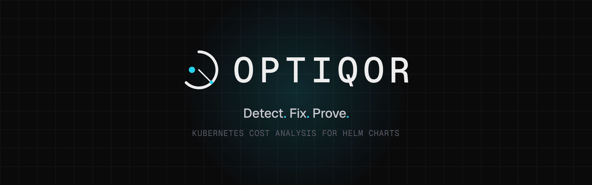
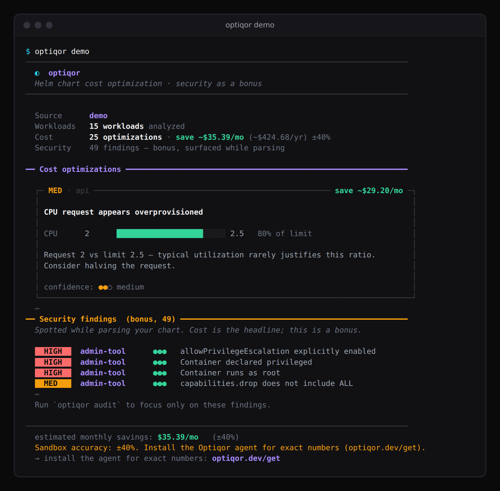
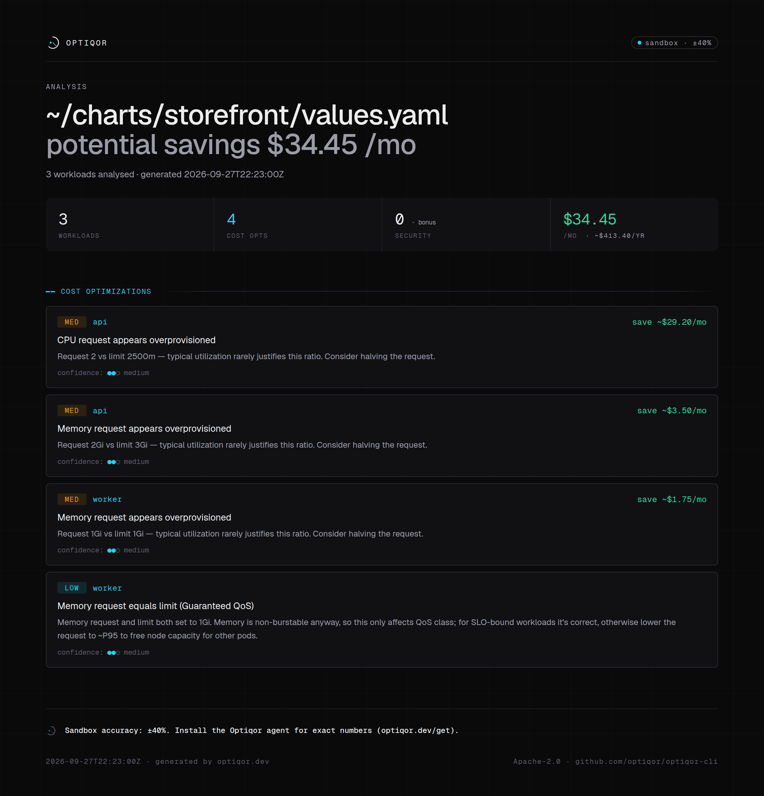
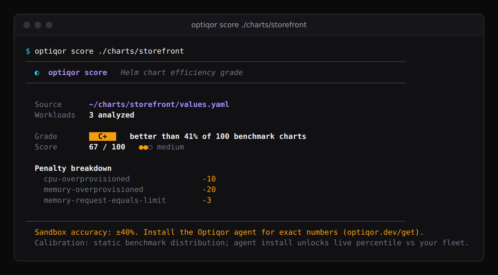
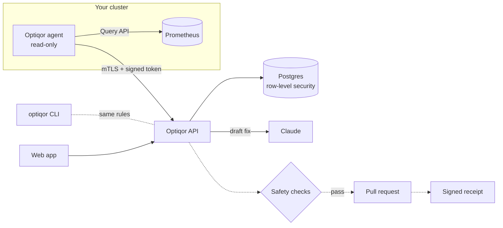

<p align="center">
  
</p>

<h3 align="center">Find the money your Kubernetes workloads waste, straight from the Helm chart.</h3>

<p align="center">
  <a href="https://github.com/optiqor/optiqor/actions/workflows/ci.yml"></a>
  <a href="https://pkg.go.dev/github.com/optiqor/optiqor-cli"></a>
  <a href="LICENSE"></a>
  
  
</p>

<p align="center">
  <a href="#quickstart">Quickstart</a> ·
  <a href="#what-optiqor-catches">What it catches</a> ·
  <a href="#reports">Reports</a> ·
  <a href="#run-it-in-ci">CI</a> ·
  <a href="#the-optiqor-platform">Platform</a> ·
  <a href="#under-the-hood">Under the hood</a>
</p>

<p align="center">
  
</p>

Most teams find out a service was oversized when the cloud bill arrives. Optiqor catches it at review time. Point it at a Helm chart and it reads every workload's requests, limits, replicas and security context, then tells you where the money goes, what to change and roughly what it's worth. It takes milliseconds and never touches your cluster.

## Quickstart

```sh
go install github.com/optiqor/optiqor-cli/cmd/optiqor@latest

optiqor demo                     # try it on a bundled chart
optiqor analyze ./charts/my-app  # then on yours
```

Needs Go 1.24 or newer. Prebuilt binaries and an npm package are on the way.

## Why Optiqor

### It works before anything is deployed

Cost tools that read cluster metrics need an agent, Prometheus and weeks of history. Optiqor reads the chart in your pull request, so the waste is flagged before it reaches production.

### Same chart, same answer

The engine is plain Go rules with no LLM and no randomness. Run it twice and you get byte-identical output, which is what you want from a CI gate.

### Honest numbers

Savings are priced at AWS on-demand rates, and every report says they are accurate to ±40%. A values file can't show real usage, and Optiqor doesn't pretend it can. When you need exact figures, the [in-cluster agent](#the-optiqor-platform) measures them.

### Your chart stays on your machine

No login, no telemetry, no update checks. The one network call in the whole CLI is `--share`, and it only happens when you pass that flag.

## What Optiqor catches

31 rules. Cost is the headline; security findings come along for free because the parser is already reading every `securityContext`.

| Cost rule | Flags |
| --- | --- |
| `cpu-overprovisioned` | CPU request close to its limit, higher than typical use justifies |
| `memory-overprovisioned` | Memory request close to its limit, higher than typical use justifies |
| `cpu-limit-far-above-request` | CPU limit many times the request, a burst the scheduler never reserved |
| `memory-limit-far-above-request` | Memory limit many times the request, an OOM kill waiting to happen |
| `oversized-cpu-limit` | CPU limit above 4 vCPU, which rules out smaller and Spot nodes |
| `oversized-memory-limit` | Memory limit above 16 GiB, which forces memory-class nodes |
| `replicas-too-high` | High static replica count with no autoscaler |
| `excessive-replica-count` | More than ~20 replicas, where cost keeps climbing and availability stops improving |
| `idle-workload` | `replicas: 0` with no autoscaler: a deployment that exists but never runs |
| `cpu-request-equals-limit` | CPU in Guaranteed QoS with no room to burst |
| `memory-request-equals-limit` | Memory request equal to the limit, right for SLO-bound pods and wasteful elsewhere |
| `cpu-without-memory-request` | CPU request set but no memory request, so memory is best-effort |
| `memory-without-cpu-request` | Memory request set but no CPU request, so pods can pile onto one node |
| `tiny-cpu-request` | CPU request under 10m, usually a scaffold placeholder |
| `tiny-memory-request` | Memory request under 32 MiB, usually a scaffold placeholder |
| `unbounded-image-tag` | Floating tag like `main`, so one release can ship different code on each rollout |

<details>
<summary><b>15 security rules</b></summary>

<br>

| Security rule | Flags |
| --- | --- |
| `run-as-root` | Container runs as root |
| `runs-as-uid-zero` | `runAsUser` is 0 |
| `privileged-container` | `privileged: true` |
| `allow-privilege-escalation` | Privilege escalation allowed |
| `capabilities-not-dropped-all` | `capabilities.drop` doesn't include `ALL` |
| `dangerous-capability-added` | Dangerous Linux capability added |
| `host-network` | `hostNetwork` enabled |
| `host-pid` | `hostPID` enabled |
| `host-ipc` | `hostIPC` enabled |
| `host-path-volume` | `hostPath` volume mounted |
| `read-only-root-fs-missing` | Root filesystem not read-only |
| `service-account-token-automount` | ServiceAccount token auto-mount not disabled |
| `image-pinned-latest` | Image pinned to `:latest` |
| `missing-cpu-limit` | No CPU limit |
| `missing-memory-limit` | No memory limit |

</details>

Every finding comes with a severity, a confidence level and, for cost rules, an estimated monthly saving.

## Reports

### Terminal

The default. Findings are ordered by savings, with a request-to-limit bar so the waste is visible at a glance. It respects `NO_COLOR` and drops colour when piped.

### HTML

`--html report.html` writes one HTML file you can attach to a pull request or send to whoever owns the budget.

<p align="center">
  
</p>

### Score

`optiqor score` grades a chart from A+ to F and ranks it against a benchmark set of 100 charts.

<p align="center">
  
</p>

### JSON

`--json` for scripts and dashboards. Reports go to stdout and everything else to stderr, so pipes stay clean.

```sh
optiqor analyze ./charts/my-app --json \
  | jq -r '.findings[] | select(.Severity == "HIGH") | "\(.Workload)  \(.DetectorID)"'
```

And for code review with a sense of humour, `--roast` rewrites the titles. The findings, numbers and severities stay exactly the same.

## Run it in CI

Fail the build when a chart change introduces a high-severity finding:

```yaml
name: optiqor
on:
  pull_request:
    paths: ["charts/**"]

jobs:
  analyze:
    runs-on: ubuntu-latest
    steps:
      - uses: actions/checkout@v5
      - uses: actions/setup-go@v6
        with:
          go-version: "1.24"
      - run: go install github.com/optiqor/optiqor-cli/cmd/optiqor@latest
      - run: optiqor analyze ./charts/my-app --fail-on high
```

Exit codes: `0` clean, `1` a finding hit the `--fail-on` threshold, `2` bad input. Team defaults can live in `.optiqor.yaml`:

```yaml
min_severity: med
fail_on: high
detectors: [cpu-overprovisioned, memory-overprovisioned, idle-workload]
```

<details>
<summary><b>All commands and flags</b></summary>

<br>

| Command | Does |
| --- | --- |
| `optiqor analyze <chart>` | Full analysis of a chart directory or values file |
| `optiqor audit <chart>` | Security findings only, fails on `high` by default |
| `optiqor score <chart>` | Letter grade, 0 to 100 score and penalty breakdown |
| `optiqor diff <a.yaml> <b.yaml>` | Cost delta between two values files |
| `optiqor demo` | Analysis of a bundled demo chart |

| Flag | Does |
| --- | --- |
| `--json` | Machine-readable output |
| `--html <path>` | Also write an HTML report |
| `-o <path>` | Write the report to a file |
| `--severity low\|med\|high` | Hide findings below a severity |
| `--detector <id>` | Only run these rules (repeatable) |
| `--fail-on low\|med\|high` | Exit 1 at or above a severity |
| `--roast` | Same findings, ruder titles |
| `--share` | Opt in to a shareable link for a sanitised report |
| `--config <path>` | Use a specific `.optiqor.yaml` |
| `--no-color` | Plain output |

</details>

## The Optiqor platform

The CLI is the first stage of the loop Optiqor is built around: detect the waste, fix it with a pull request someone can review, and prove the saving against the real bill. The rest of the platform lives in [`backend/`](backend/).

| Stage | What it does | Status |
| --- | --- | --- |
| Detect: CLI | 31 rules over Helm values, offline | Available |
| Detect: sandbox API | The same rules behind an HTTP endpoint, with shareable result pages | Preview |
| Detect: in-cluster agent | Read-only agent that measures real CPU, memory, OOM kills and 30-day p95/p99 from Prometheus | Preview |
| Fix: Apply Fix | Claude drafts the Helm values change; deterministic checks decide whether it is safe to ship | In development |
| Prove: signed receipts | Each saving recorded as an Ed25519 or ECDSA P-256 signed receipt anyone can verify | In development |
| Prove: bill reconciliation | Savings matched against the AWS Cost and Usage Report | Planned |



<sub>Dashed steps are in development.</sub>

## Under the hood

The parts engineers usually ask about:

- One rule engine, two surfaces. The API imports the CLI's public [`pkg/rules`](pkg/rules) and [`pkg/parser`](pkg/parser) packages, so the web sandbox and the terminal can't disagree. The CLI never imports the backend.
- Deterministic by construction. Golden files in [`testdata/golden`](testdata/golden) are compared byte for byte on every CI run, on Linux and macOS.
- The LLM never decides. Claude writes the explanation and the diff. Plain Go checks decide whether it ships: the diff must apply, labels must survive, no resource can be cut by more than half, and PDBs, quotas, LimitRanges, HPA bounds and recent OOM kills are checked first. Calls are sanitised, capped at $0.40 each and cost-recorded. ([ADR-0007](backend/docs/adr/0007-llm-isolation.md))
- Tenant isolation in the database. Every tenant-scoped query runs with `app.tenant_id` set and Postgres row-level security does the filtering, so a missing `WHERE` clause can't leak data. An integration test proves it against a real Postgres. ([ADR-0003](backend/docs/adr/0003-shared-tables-rls.md))
- An agent you can let into production. Read-only ClusterRole, outbound connections only, TLS 1.3 client certificates and a signed token on every batch. ([ADR-0008](backend/docs/adr/0008-agent-permissions.md), [ADR-0018](backend/docs/adr/0018-agent-mtls-spiffe.md))
- Decisions written down. 21 architecture decision records in [`backend/docs/adr`](backend/docs/adr), from choosing a modular monolith over microservices to moving receipt signing to ECDSA so the key can live in KMS.

About 24,000 lines of Go, 20,000 lines of Go tests and 600 test functions across the two modules. CI runs `go test -race`, golangci-lint, CodeQL, gosec, govulncheck, gitleaks and Trivy, and release images are signed with cosign.

Built with Go, PostgreSQL 16 and TimescaleDB, Next.js 16, React 19, Tailwind 4, client-go, the Anthropic API and Terraform on AWS.

## Repository

```
cmd/optiqor/        the CLI
pkg/rules/          the 31 rules (public Go API)
pkg/parser/         Helm values to workloads (public Go API)
pkg/htmlrender/     HTML report
internal/           commands, renderers, config
backend/            API, worker, in-cluster agent, web app, Terraform
```

Use the rules from your own Go program:

```go
workloads, err := parser.ParseValues(valuesFile)
if err != nil {
	return err
}
findings := rules.Run(workloads, rules.All())
```

## Build from source

```sh
git clone https://github.com/optiqor/optiqor && cd optiqor
make build && ./bin/optiqor demo
make test
```

The backend has its own toolchain: `cd backend && make bootstrap && make dev` brings up Postgres, Redis and Temporal in Docker, runs the migrations and starts the API and web app.

## Contributing

Issues and pull requests are welcome. Read [CONTRIBUTING.md](CONTRIBUTING.md) first: Conventional Commit titles, DCO sign-off and a golden test for any output change. Report security issues privately through [SECURITY.md](SECURITY.md).

## License

The CLI is [Apache-2.0](LICENSE), and so is the in-cluster agent ([backend/LICENSE-agent](backend/LICENSE-agent)). The rest of `backend/` is under [backend/LICENSE](backend/LICENSE).

<p align="center">
  <br>
  <b>Optiqor</b> · Detect. Fix. Prove.
  <br>
  <sub>Built by <a href="https://github.com/btwshivam">Shivam Kumar</a></sub>
</p>
